# ipfs-lookup-measurement

## Result

### Content publish

#### 1 Overall content publish latency

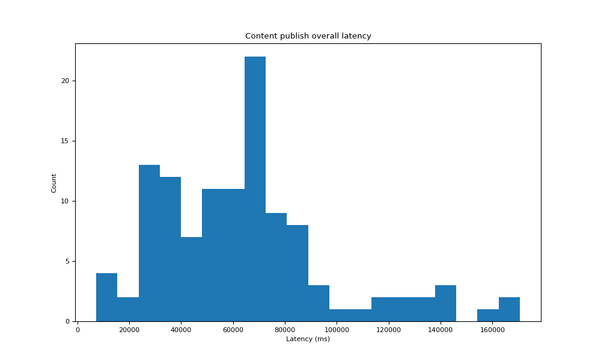

This graph is a histogram of the total latency in content publish phase. It includes the time of the DHT walk to discover 20 cloest peers to the content and the time of putting the provider record.

#### 2 Agent version for all encountered nodes during content publish

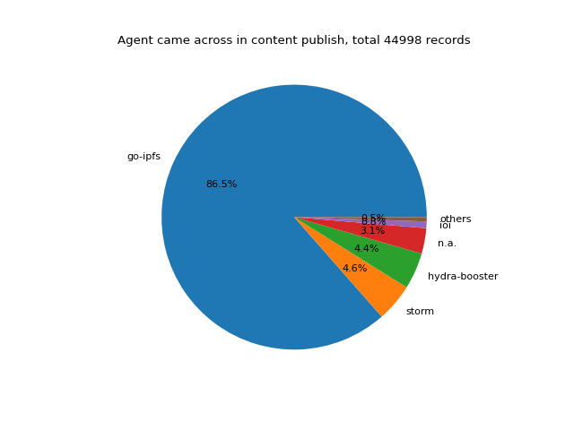

This graph is a pie chart of the agent version for all encountered nodes during content publish.

#### 3 Content publish DHT search latency

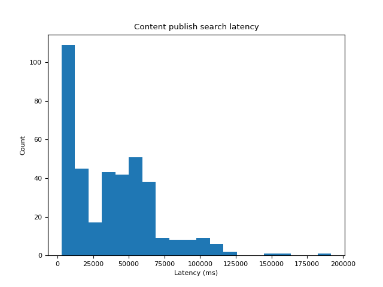

We break down the overall latency and this graph is a histogram of the latency involved in the DHT walk of publishing content.

#### 4 Content publish PUT provider record latency

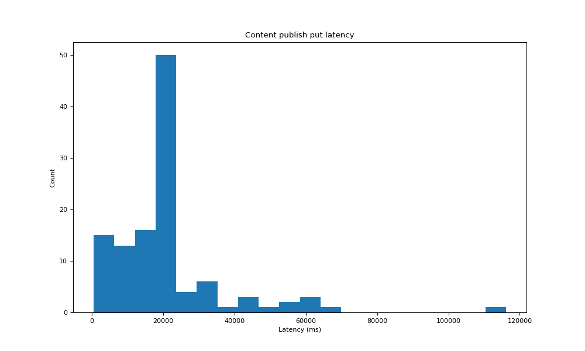

We break down the overall latency and this graph is a histogram of the latency involved in putting the provider record to the discovered closest peers. 

#### 5 Content publish PUT provider record SUCCEED latency

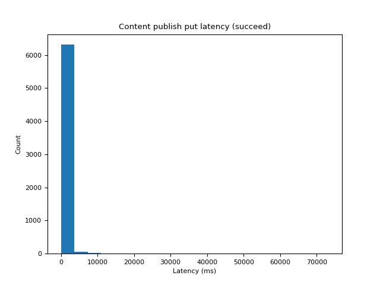

When we put the provider record to a peer, most of the time this action is successful and this graph is a hisogram of the latency involved in successful putting provider record.

#### 6 Agent version for nodes that we SUCCEED in putting a provider record

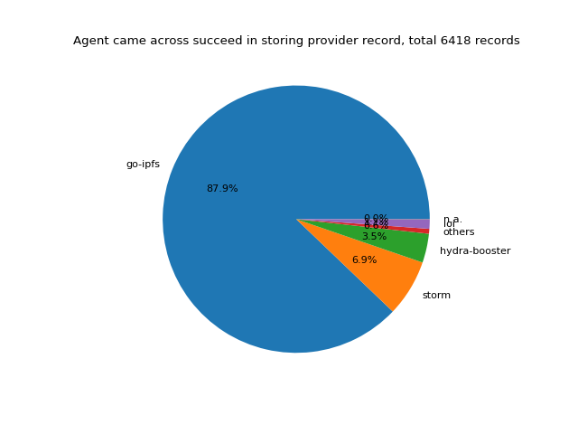

This graph is a pie chart further showing the agent version of the nodes that we successfully put a provider record in.

#### 7 Content publish PUT provider record FAILED latency

When we put the provider record to a peer, sometimes this action is failed and this graph is a hisogram of the latency involved in failed putting provider record.

#### 8 Agent version for nodes that we FAILED in putting a provider record

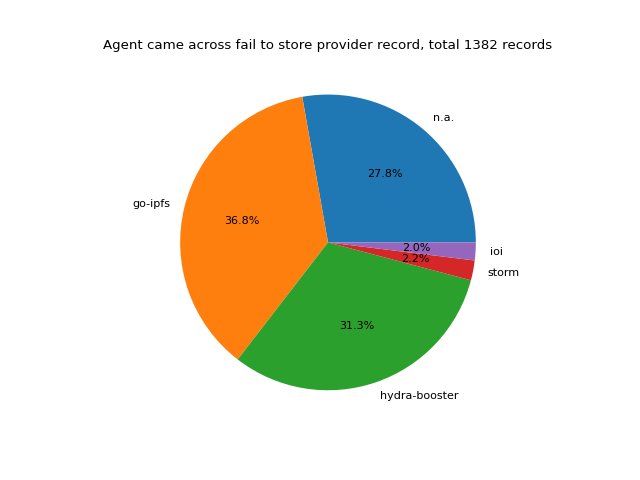

This graph is a pie chart further showing the agent version of the nodes that we fail to put a provider record in. (TODO, figure out why hydra-booster is so high.)

#### 9 Overall content retrieval latency

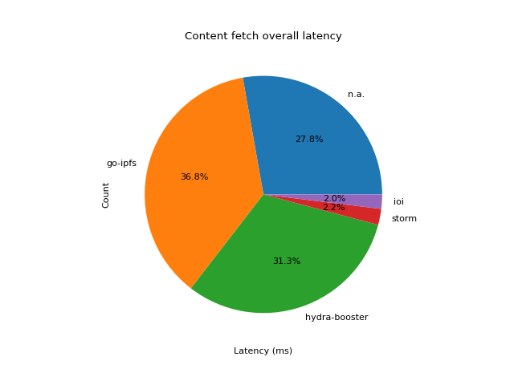

This graph is a histogram of the total latency in content retrieval phase. It includes the time of the DHT walk to discover the provider record and the time of retrieving the content.

#### 10 Agent version for all encountered nodes during content retrieval

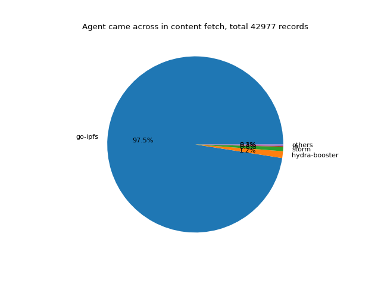

This graph is a pie chart of the agent version for all encountered nodes during content retrieval.

#### 11 Content retrieval DHT search latency

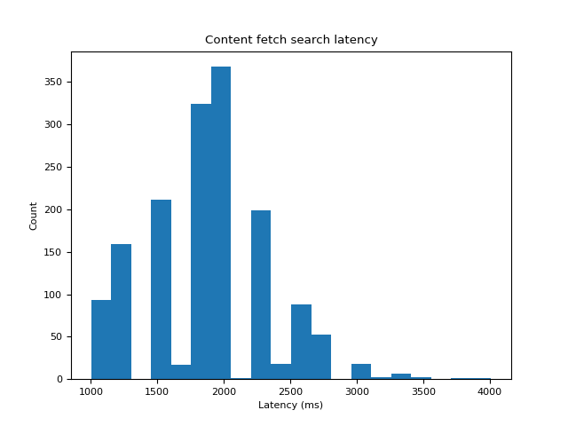

We break down the overall latency and this graph is a histogram of the latency involved in the DHT walk of retrieving content.

#### 12 Content retrieval fetch latency

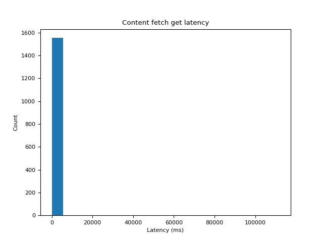

We break down the overall latency and this graph is a histogram of the latency involved in the actual fetch of the content. Because our test file are generally small in size, so this latency can be viewed as the approximate latency to first byte.
