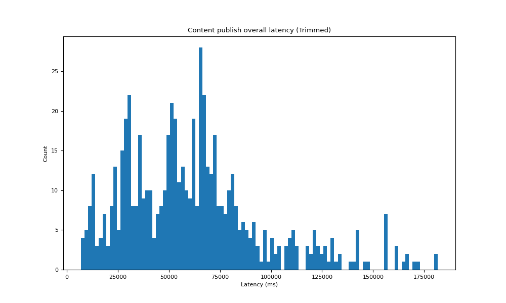
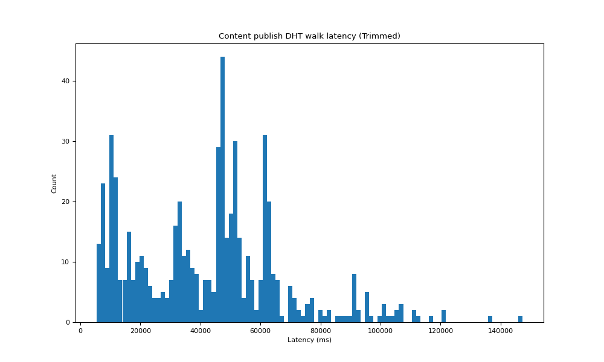
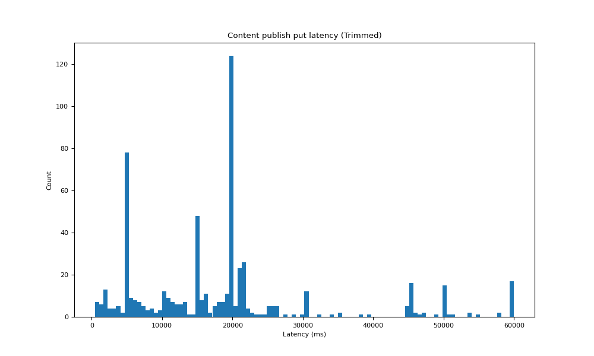
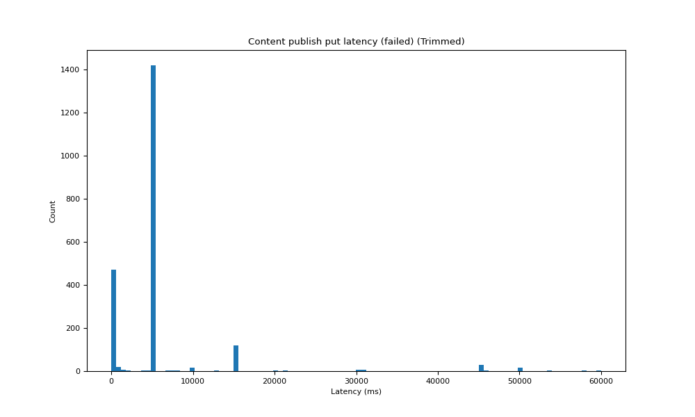
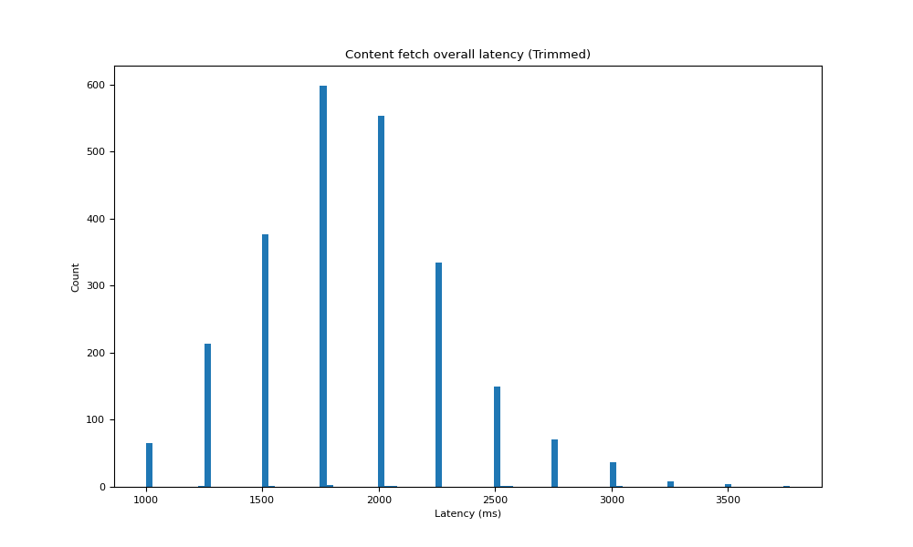
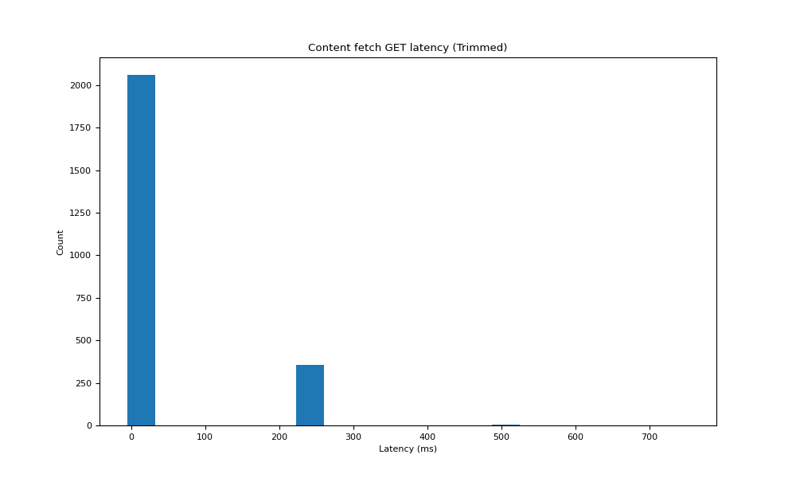

# ipfs-lookup-measurement

## Instructions

Follow these instructions to deploy testing nodes and monitor in AWS.
First of all, you need to make sure you have terraform cli and AWS cli installed, check https://learn.hashicorp.com/tutorials/terraform/install-cli and https://aws.amazon.com/cli/ for information on how to install on your machine.
To check if you have them installed:
```
terraform version
aws --version
```
Secondly, you need to configure aws with your credentials by run `aws configure`.
Thirdly, you need to build the controller.
```
cd controller
make build
```
Lastly, you are ready to spin up the nodes.
```
terraform init (Only need to run at the first time)
./up.sh
```
This script will automatically spins up 5 testing nodes and 1 monitor node in sydney AWS. If you wish to spin up more nodes or with more complicated setup. Please have a look at the `main.tf` file. It is very easy to use different configurations.
This script will also automatically open the monitor in the browser. Wait for the monitor to come alive and log in with default username `admin` and default password `admin`. Remember to change the password after you logged in. After the monitor is alive, navigate to `Dashboards -> manage -> IPFS Measurement Logging`. Wait for all nodes to output the first logging before the next step. After every node is alive, start the experiment using:
```
./run.sh
```
`run.sh` will start the experiment. It will run an experiment every 60 seconds. The provider will rotate among all the nodes deployed. Controller will ask the provider to publish a content. After the content is published (the whole publication process is finished), the controller will then immediately ask the rest of the nodes to fetch the content. This is called one experiment. The controller can be run as:
```
./controller/controller (This will run a single experiment)
OR
./controller/controller -i 60 (This will run experiments every 60 seconds, -i is used to specify the interval)
```
After you run the experiments for relatively long time (6 hours for example), you can download the logs and generate the plots by
```
python3 ./analysis/download_logs.py
python3 ./analysis/plot.py
```
Then you should be able to see figures under `./figs` directory.

Note, if you are running multiple nodes, change the `download_logs.py` line 6 `num_nodes=$(Number of nodes)`.

## Result

### Content publish

#### 1 Overall content publish latency


This graph is a histogram of the total latency in content publish phase. It includes the time of the DHT walk to discover 20 cloest peers to the content and the time of putting the provider record.



This is the graph after we exlude the outliers and focus on the latency that is less than 200000ms.

#### 2 Agent version for all encountered nodes during content publish


This graph is a bar chart of the agent version for all encountered nodes during content publish.

#### 3 Content publish DHT walk search latency


We break down the overall latency and this graph is a histogram of the latency involved in the DHT walk of publishing content.



This is the graph after we exlude the outliers and focus on the latency that is less than 150000ms.

#### 4 Content publish DHT walk encountered agent


This graph is a bar chart of the agent version for all encountered nodes in the DHT walk of the content publish.

#### 5 Content publish PUT provider record latency


We break down the overall latency and this graph is a histogram of the latency involved in putting the provider record to the discovered closest peers. 



This is the graph after we exlude the outliers and focus on the latency that is less than 150000ms.

#### 6 Content publish PUT encountered agent


This graph is a bar chart of the agent version for all nodes selected to store the provider record in content publish.

#### 7 Content publish PUT provider record SUCCEED latency


When we put the provider record to a peer, most of the time this action is successful and this graph is a hisogram of the latency involved in successful putting provider record.


This is the graph after we exlude the outliers and focus on the latency that is less than 2000ms.

#### 8 Content publish PUT provider record SUCCEED agent


This graph is a bar chart of the agent version for all nodes that succeed in storing a provider record.

#### 9 Content publish PUT provider record FAILED latency


When we put the provider record to a peer, sometimes this action is failed and this graph is a hisogram of the latency involved in failed putting provider record.



This is the graph after we exlude the outliers and focus on the latency that is less than 60000ms.

#### 10 Content publish PUT provider record FAILED agent


This graph is a bar chart of the agent version for all nodes that fail to store a provider record.

#### 11 Overall content retrieval latency


This graph is a histogram of the total latency in content retrieval phase. It includes the time of the DHT walk to discover the provider record and the time of retrieving the content.



This is the graph after we exlude the outliers and focus on the latency that is less than 4000ms.

#### 12 Agent version for all encountered nodes during content retrieval


This graph is a bar chart of the agent version for all encountered nodes during content retrieval.

#### 11 Content retrieval DHT walk search latency


We break down the overall latency and this graph is a histogram of the latency involved in the DHT walk of retrieving content.


This is the graph after we exlude the outliers and focus on the latency that is less than 2750ms.

#### 12 Content retrieval DHT walk encountered agent


This graph is a bar chart of the agent version for all countered nodes during DHT walk of retrieving content.

#### 13 Content retrieval fetch latency


We break down the overall latency and this graph is a histogram of the latency involved in the actual fetch of the content. Because our test file are generally small in size, so this latency can be viewed as the approximate latency to first byte.



This is the graph after we exlude the outliers and focus on the latency that is less than 700ms.

#### 14 Content retrieval encountered agent


This graph is a bar chart of the agent version for all nodes that we got a provider record from during retrieving content.

#### 15 Agent version for nodes that fail to get a provider record after a successful put


This graph is a bar chart of the agent version for the nodes that succeed in putting a provider record but fail to obtain a provider record after this. The failed rate is out of the total number reported in Figure 8.

#### 16 Error message for the nodes that fail to get a provider record after a successful put


This graph is a bar chart of the error message when we fail to obtain the provider record after a successful put.

#### 17 Agent version for nodes that get empty provider record after a successful put


This graph is a bar chart of the agent version for the nodes that succeed in putting a provider record but got empty provider record after this.

#### 18 Error message for hydra-booster nodes that fail to put a provider record.


This graph is a bar chart of the error message when hydra-booster nodes fail to store a provider record.