# ipfs-lookup-measurement

## Result

### Content publish

#### 1 Overall content publish latency

This graph is a histogram of the total latency in content publish phase. It includes the time of the DHT walk to discover 20 cloest peers to the content and the time of putting the provider record.

#### 2 Agent version for all encountered nodes during content publish

This graph is a bar chart of the agent version for all encountered nodes during content publish.

#### 3 Content publish DHT walk search latency

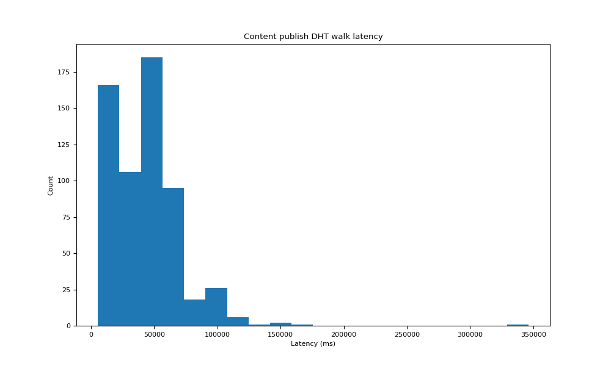

We break down the overall latency and this graph is a histogram of the latency involved in the DHT walk of publishing content.

#### 4 Content publish DHT walk encountered agent

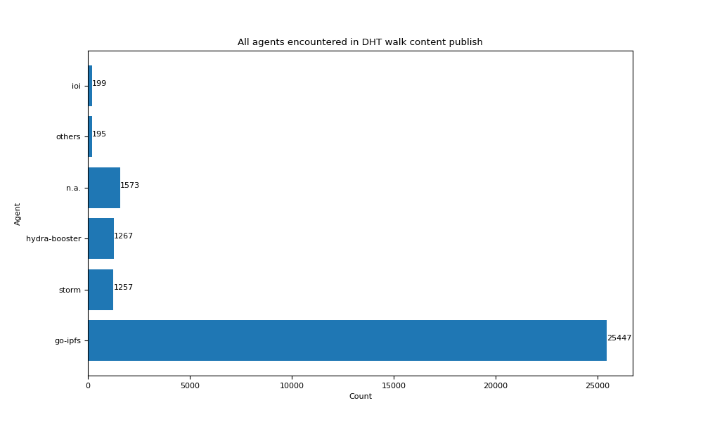

This graph is a bar chart of the agent version for all encountered nodes in the DHT walk of the content publish.

#### 5 Content publish PUT provider record latency

We break down the overall latency and this graph is a histogram of the latency involved in putting the provider record to the discovered closest peers. 

#### 6 Content publish PUT encountered agent

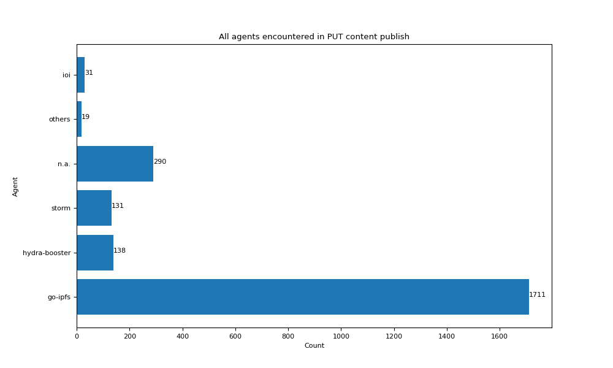

This graph is a bar chart of the agent version for all nodes selected to store the provider record in content publish.

#### 7 Content publish PUT provider record SUCCEED latency

When we put the provider record to a peer, most of the time this action is successful and this graph is a hisogram of the latency involved in successful putting provider record.

#### 8 Content publish PUT provider record SUCCEED agent

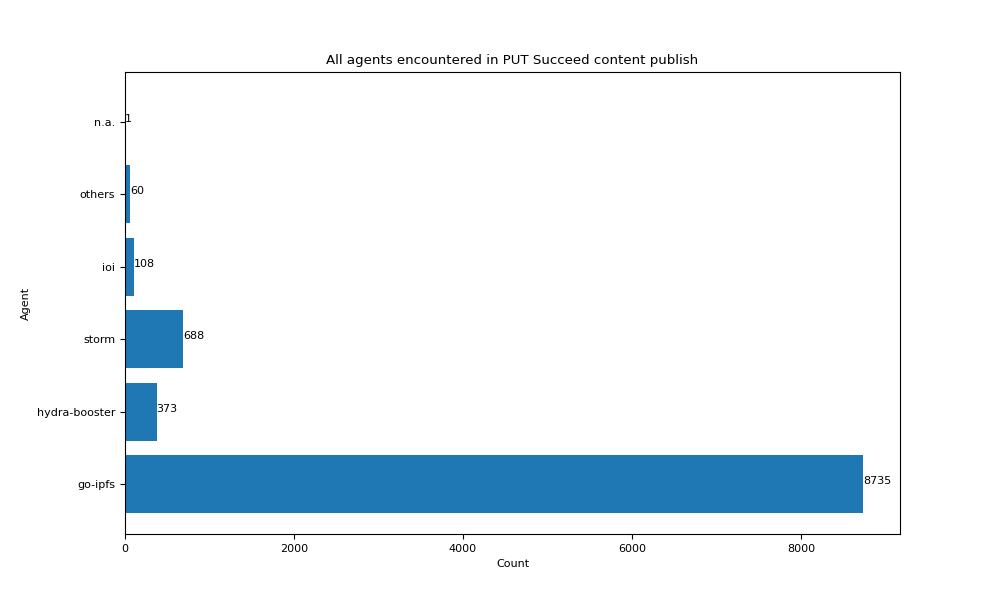

This graph is a bar chart of the agent version for all nodes that succeed in storing a provider record.

#### 9 Content publish PUT provider record FAILED latency

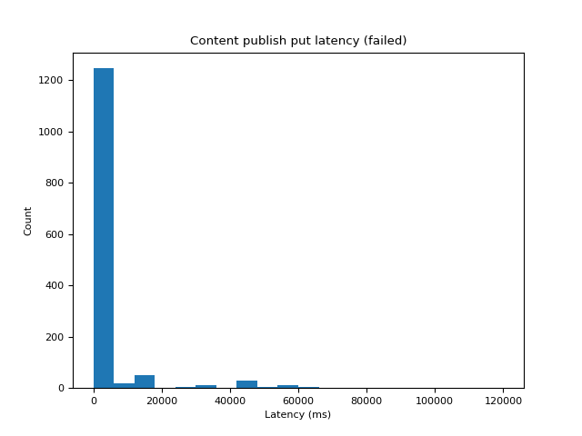

When we put the provider record to a peer, sometimes this action is failed and this graph is a hisogram of the latency involved in failed putting provider record.

#### 10 Content publish PUT provider record FAILED agent

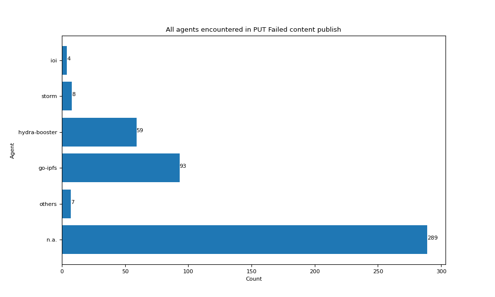

This graph is a bar chart of the agent version for all nodes that fail to store a provider record.

#### 11 Overall content retrieval latency

This graph is a histogram of the total latency in content retrieval phase. It includes the time of the DHT walk to discover the provider record and the time of retrieving the content.

#### 12 Agent version for all encountered nodes during content retrieval

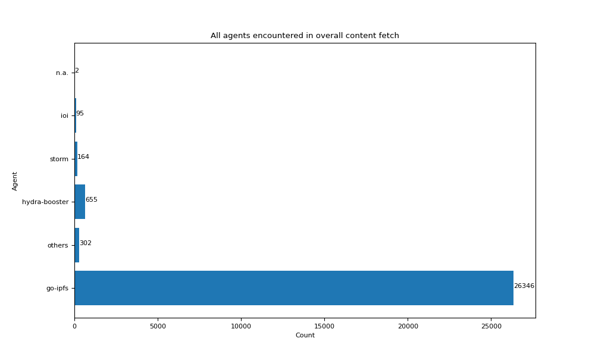

This graph is a bar chart of the agent version for all encountered nodes during content retrieval.

#### 11 Content retrieval DHT walk search latency

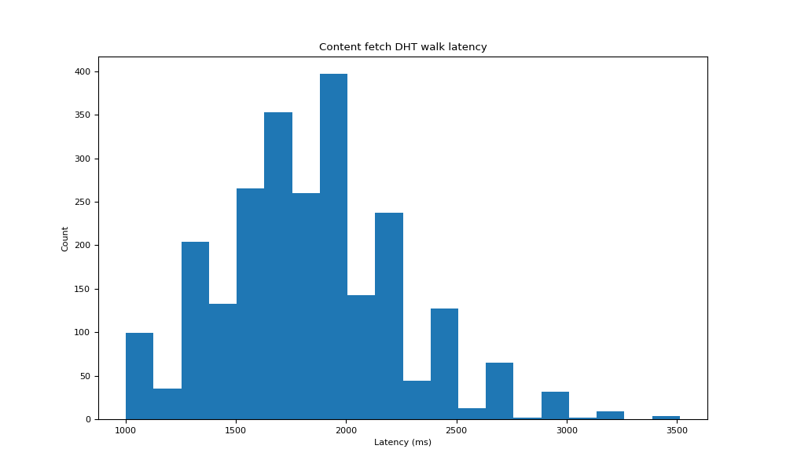

We break down the overall latency and this graph is a histogram of the latency involved in the DHT walk of retrieving content.

#### 12 Content retrieval DHT walk encountered agent

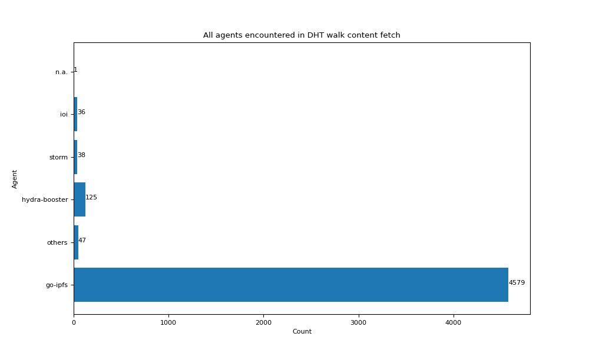

This graph is a bar chart of the agent version for all countered nodes during DHT walk of retrieving content.

#### 13 Content retrieval fetch latency

We break down the overall latency and this graph is a histogram of the latency involved in the actual fetch of the content. Because our test file are generally small in size, so this latency can be viewed as the approximate latency to first byte.

#### 14 Content retrieval encountered agent

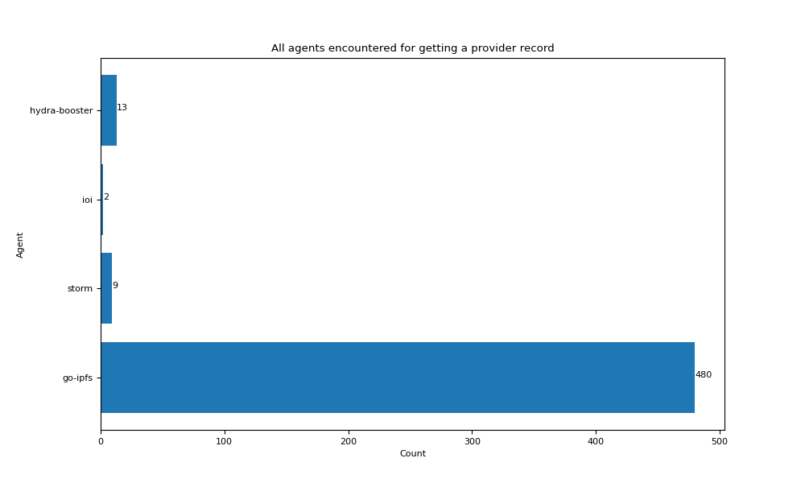

This graph is a bar chart of the agent version for all nodes that we got a provider record from during retrieving content.

#### 15 Agent version for nodes that fail to get a provider record after a successful put

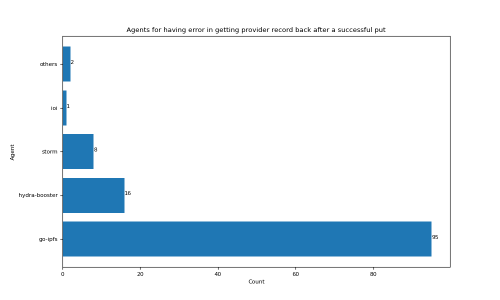

This graph is a bar chart of the agent version for the nodes that succeed in putting a provider record but fail to obtain a provider record after this.

#### 16 Error message for the nodes that fail to get a provider record after a successful put

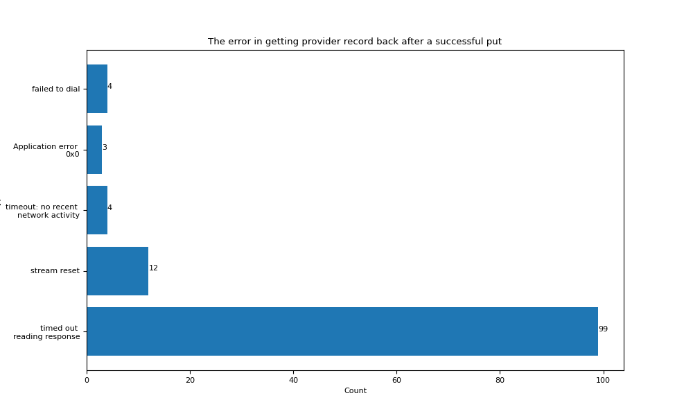

This graph is a bar chart of the error message when we fail to obtain the provider record after a successful put.

#### 17 Agent version for nodes that get empty provider record after a successful put

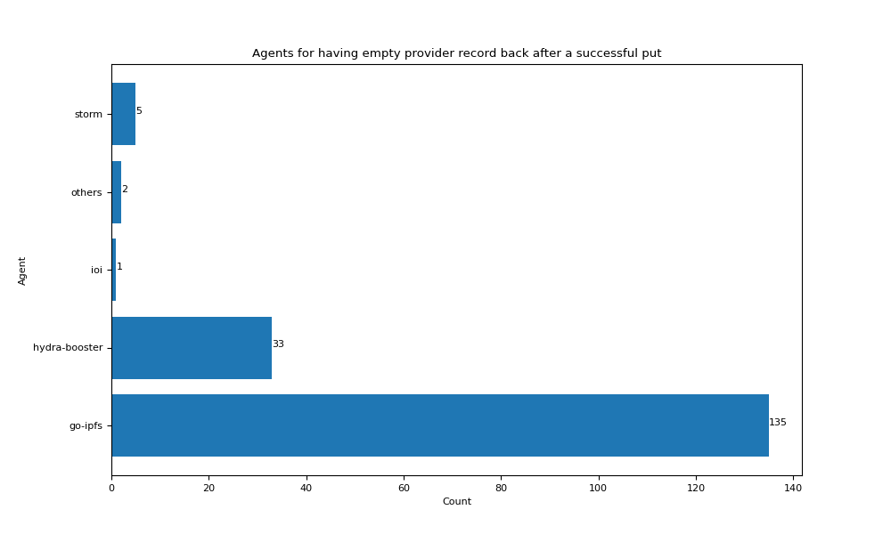

This graph is a bar chart of the agent version for the nodes that succeed in putting a provider record but got empty provider record after this.

#### 18 Error message for hydra-booster nodes that fail to put a provider record.

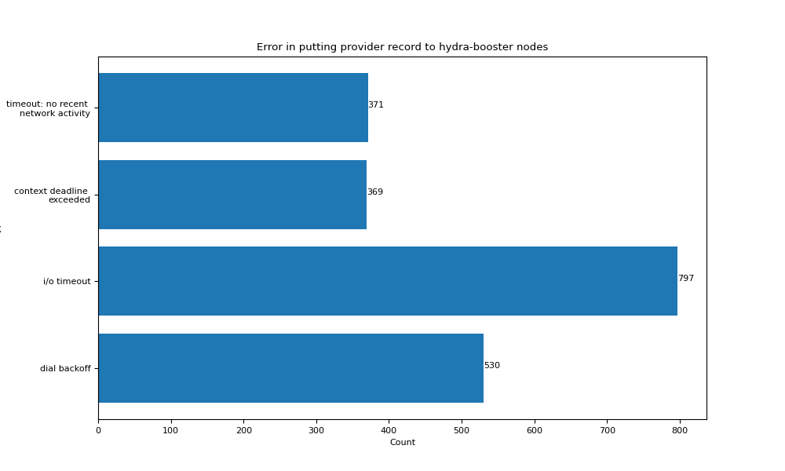

This graph is a bar chart of the error message when hydra-booster nodes fail to store a provider record.
